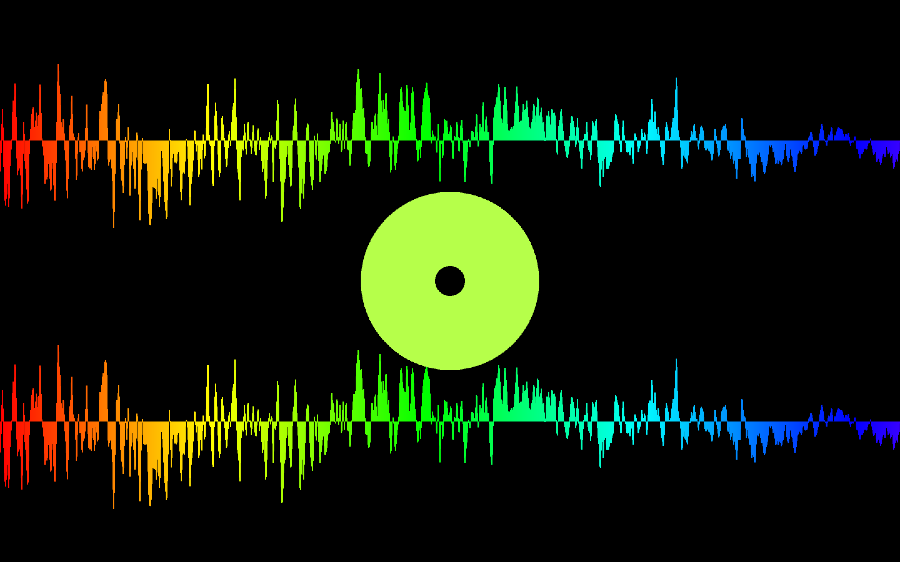
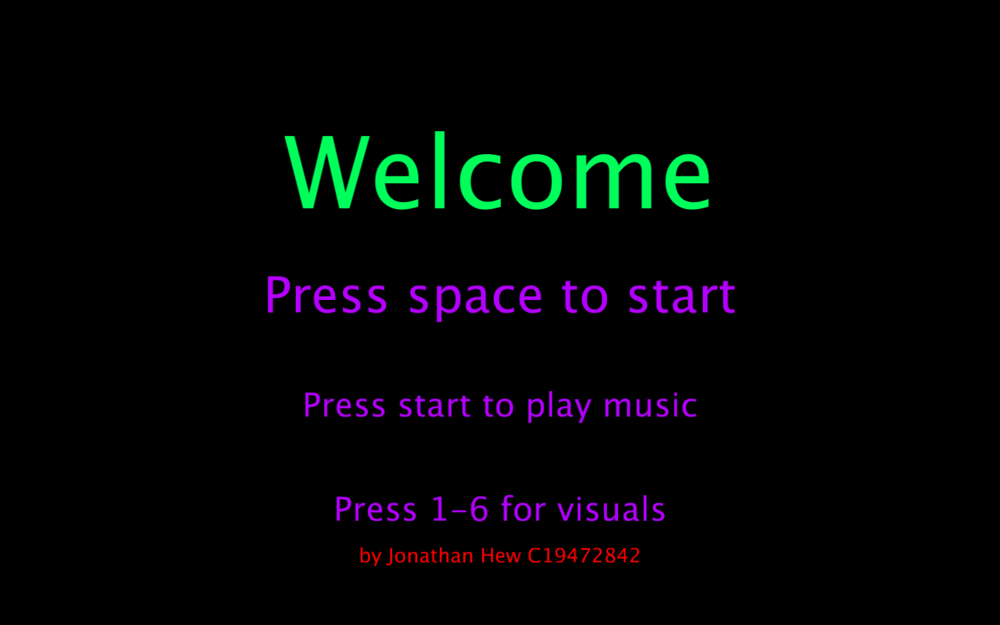
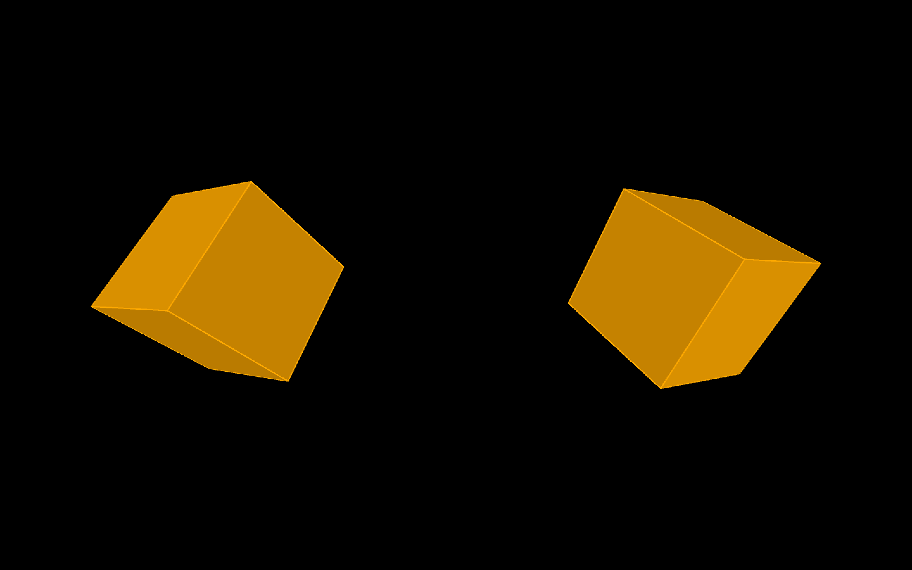
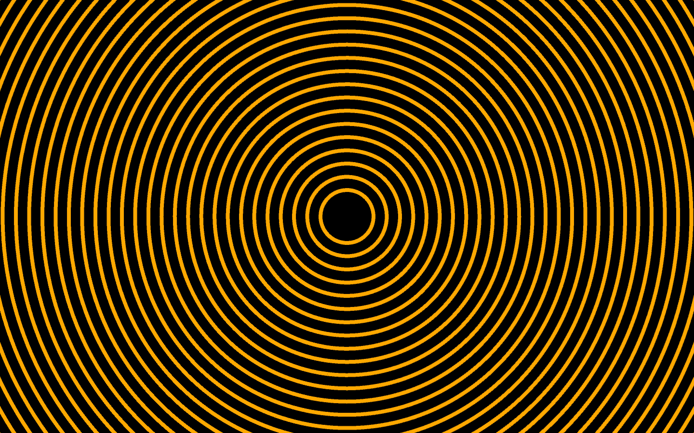
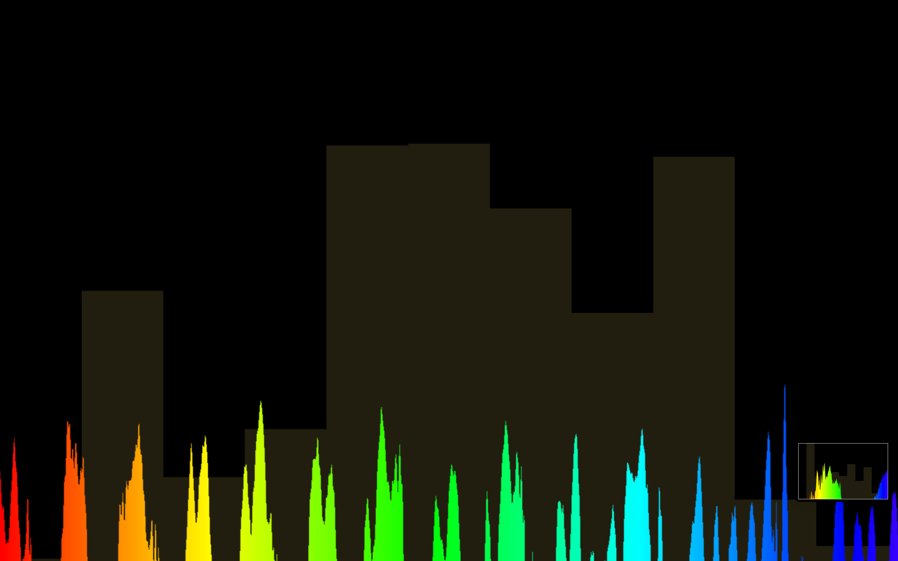
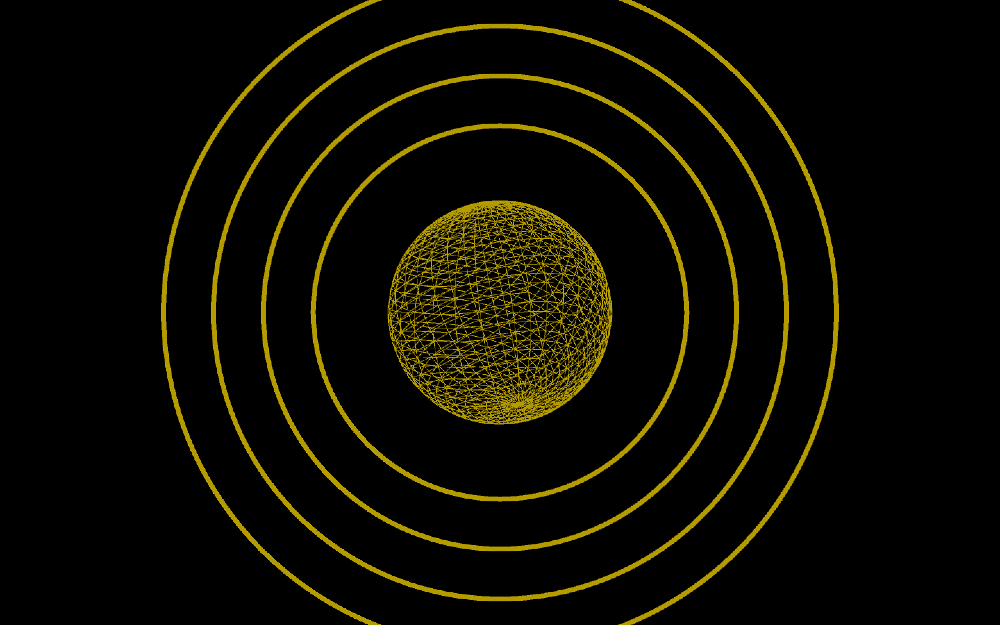

# Music Visualiser Project

Name: Jonathan Hew 

Student Number: C19472842

## Instructions
- Fork this repository and use it a starter project for your assignment
- Create a new package named your student number and put all your code in this package.
- You should start by creating a subclass of ie.tudublin.Visual
- There is an example visualiser called MyVisual in the example package
- Check out the WaveForm and AudioBandsVisual for examples of how to call the Processing functions from other classes that are not subclasses of PApplet

# Description of the assignment
For this assignment I had to create a visual art piece which would respond to the music that was being played. We were given the line "Something beautiful to enjoy while listening to music" which I had to follow. My goal was to make a visual which would leave the listener almost lost in a trance while listening to the music. I wanted the visual to free the mind of the listener so they could fully enjoy the music. I decided to make 6 different visual arts inpired by a particular song. 

The song i chose for this assignment was Hooligan by Baby Keem. I chose this song because i really liked the instrumental in it. Thesong has a very simplistic feel- with a gorgeous piano introduction and a simple beat. The song wonderfully sticks to a basic feel, making it instantly catchy. It doesn’t rely on hard drops to make the song stick on the mind. The calm flow throughout the song is exactly what i needed to fulfill my goal of having the user calm and free minded.

In this assignment i used both 2D and 3D visuals and lots of colors. These shapes and color change accordingly to the amplitude and frequency of the song being played. 

# Youtube Video Link 
Please click the video image below to view the demo.
[](https://youtu.be/gE4DZEgoQW8)

# Instructions
This was compiled and ran on MAC.

1. Run the code and a welcome screen will appear.

2. To start the music press SPACE key.

3. To select/toggle through the visuals i hgave created select from the keys 1 - 6.

4. The visuals are :

	- i. CircleWaveForm 
	- ii. Cubes
	- iii. Circles
	- iv. BoxedSpheres
	- v. WaveForm with AudioBands behind
	- vi. CircledSphere


# How it works
JonathanVisual is the subclass of the Visual Class. This means that JonathansVisual has access to all the functions which were included in Visual. Each visual i have created has its own class. An object of each visual class will then be created in JonathansVisual as seen below I used inheritance to make JoathansVisual extend the Visual class to do all this.

```Java
public class JonathansVisual extends Visual
{

    WaveForm wf;
    AudioBandsVisual abv;
    Cubes cub;
    Circle cir;
    CircleWaveForm cwf;
    BoxedSphere bsp;
    CircledSphere csp;
    Welcome wel;
}
```
The classes with the music visuals have an instance of JonathansVisual passed into them and referenced as 'jv' as seen below. As a result of this all processing libraries and code given to us in Visual.java can be used by all the music visual classes i have created even though they are not a subclass of Visual.

```Java
public class CircleWaveForm {
    JonathansVisual jv;
    
	public CircleWaveForm(JonathansVisual jv)
	    {
		this.jv = jv; 
	    }
}
```

In the setup method of JonathansVisual the objects for each visual class are created. This is also where i load the song i want to play. To change the song you would simply edit this string to the name of an .mp3 file which is located in the data folder. note: surface.setResizable(true); was added to make the program compatible with MacOS.
```Java
public void setup()
    {
        surface.setResizable(true);

        startMinim();

        // Call loadAudio to load an audio file to process 
        loadAudio("hooligan.mp3"); 

        wf = new WaveForm(this);
        abv = new AudioBandsVisual(this);
        cub = new Cubes(this);
        cir = new Circle(this);
        cwf = new CircleWaveForm(this);
        bsp = new BoxedSphere(this);
        csp = new CircledSphere(this);
        wel = new Welcome(this);
    }
```

The keyPressed method will check the user for input. The method performs a different task depending on what key is pressed. Spacebar, and the 'r' key will control the music while keys 1 - 6 will control the visuals.
```Java
public void keyPressed()
    {
        if (key == ' ')
        {
            if (getAudioPlayer().isPlaying()) {
                getAudioPlayer().pause();
            }
            else {
                getAudioPlayer().play();
            }
    
        }

        if(key == 'r') {
            // Rewinds the song 
            getAudioPlayer().cue(0);
        }

        if (key >= '0' && key <= '6')
        {
            which = key - '0';
        }
    }
```

In the draw method i used a Switch case to allow the user to toggle through the visuals. The render method in each music visual class is then called within each case. This will display the selected visual from the listener.
```Java
public void keyPressed()
    {
        if (key == ' ')
        {
            if (getAudioPlayer().isPlaying()) {
                getAudioPlayer().pause();
            }
            else {
                getAudioPlayer().play();
            }
    
        }

        if(key == 'r') {
            // Rewinds the song 
            getAudioPlayer().cue(0);
        }

        if (key >= '0' && key <= '6')
        {
            which = key - '0';
        }
    }

    public void draw()
    {
        ...
	
        //switch case to choose between visuals
        switch (which)
        {
            case 1:
            {
                cwf.render();
                break;
            }//end case 1;
            case 2: 
            {
                cub.render();
                break;
            }//end case 2
            case 3:
            {
                cir.render();
                
                break;
            }//end case 3
            case 4:
            {
                bsp.render();
                break;
            }//end case 4 
            case 5:
            {
                wf.render();
                abv.render();
                break;
            }//end case 5
            case 6:
            {
                
                csp.render();
                break;
            }//end case 6
            default:
            {
                wel.render();
            }//end default
        }//end switch
}//end draw
```

# What I am most proud of in the assignment
What i am most proud of in my assignment is the CircleWaveform visual that i have created. Althought this is a very simple visual in terms of code i feel like it is very effective in terms of my goal of leaving the user in a trance. I am proud of this because i am able to show people who may have little/no experience in coding, this visual and show them the source code and how easy it was to implement it. I like this visual the most from the ones i have created because it is simplitsic but yet very effective. 


# Visuals I created







